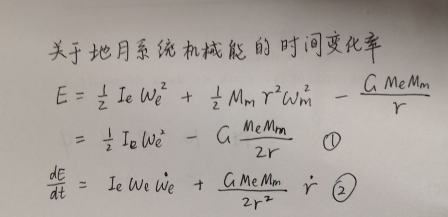
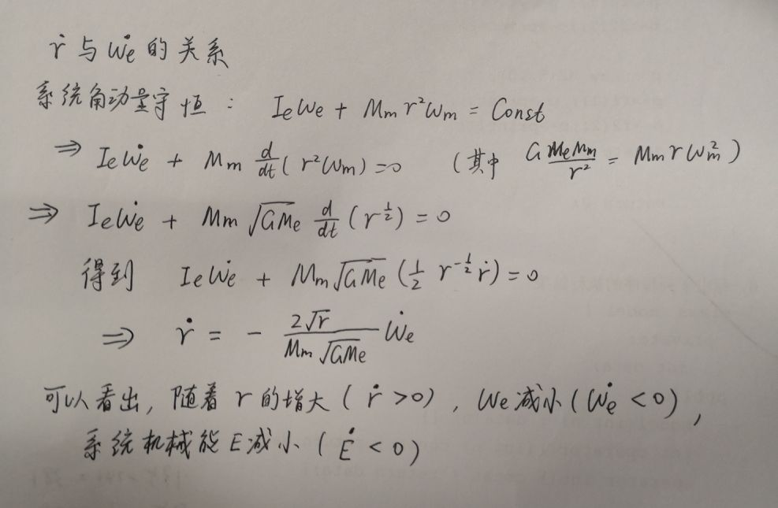
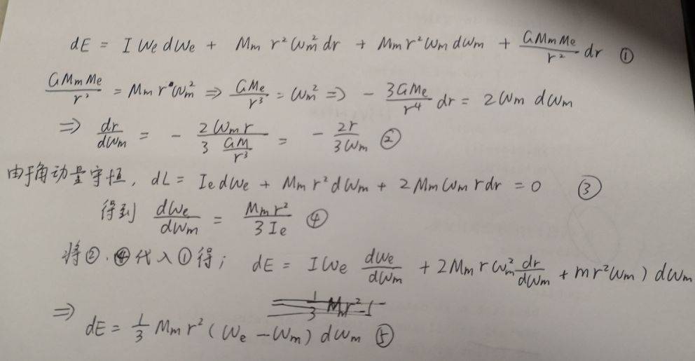
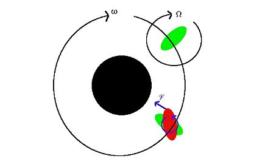
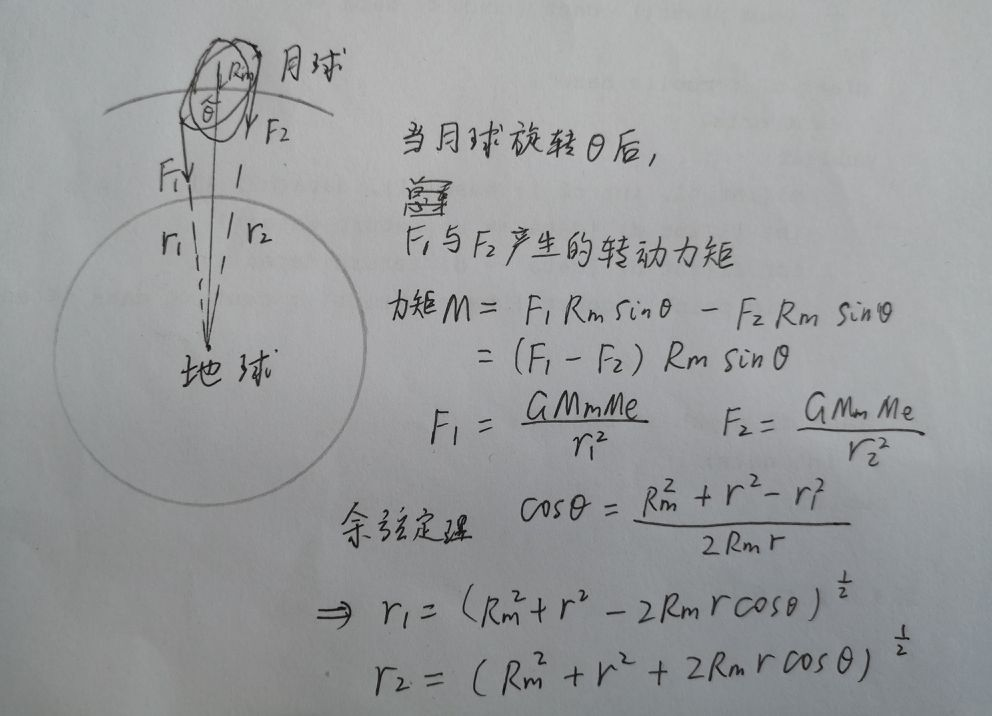
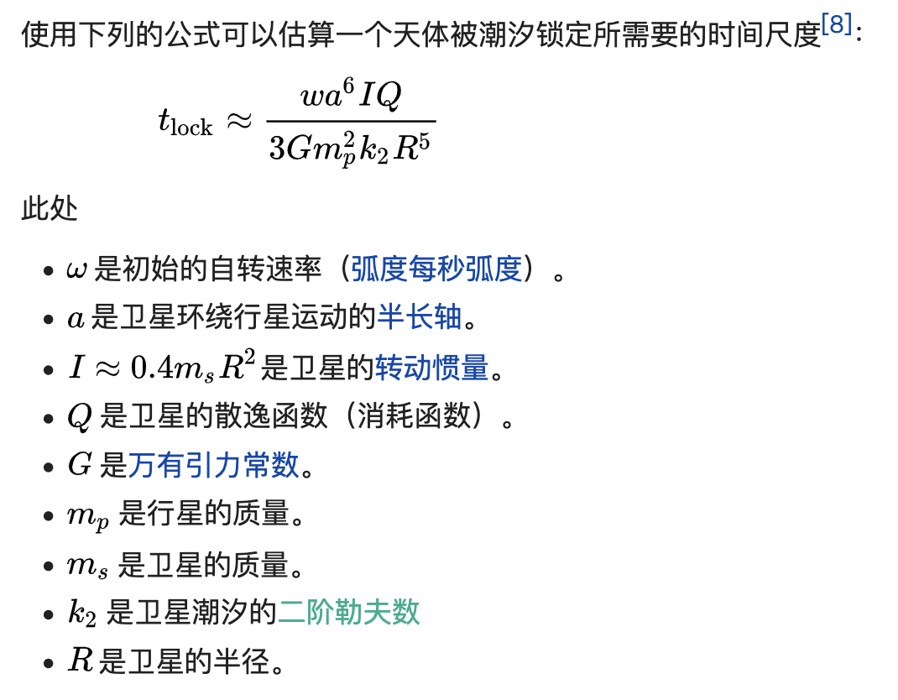

# 关于地月系统的研究

## by 刘成锴

## 1、兴趣和动机

月球是地球的唯一一颗卫星。

在一部BBC的纪录片中，我得知曾经地月距离比现在更小，地球自转周期更短。而地球自转周期的增加，恰恰与月球密切相关。  
此外，还有一个有趣的现象，我们在地球上始终只能看到月球的一面，这说明月球的自转周期与公转周期相等（即自转和公转的角速度相等）！  
因此，我对地月系统产生了浓厚的兴趣，想要对其进行研究。

## 2、可能相关的物理量
在开始研究之前，我考虑到了以下这些**相关的物理量**：

* 地球的质量$M_e$
* 月球的质量$M_m$
* 地月距离$r$ 
* 地球自转角速度$\omega_e$
* 月球自转和公转角速度$\omega_m$
* 地球的转动惯量$I_e$
* 月球的转动惯量$I_m$

## 3、疑问
我有以下疑问。
1. 为什么地月距离越来越远？
2. 为什么地球自转越来越慢，即自转周期越来越长？
3. 为什么月球的自转周期与其绕地球公转的周期相等？

## 4、探究过程
### （1）相关资料
首先，我在网上搜到了相关资料。发现我的疑问和“潮汐”密切相关！

资料内容如下：
> 「 由于潮汐运动，地球自转的角速度会发生微小的变化，从而地球和月球的间距以及地球和月球系统的总能量也将发生变化 」    
> 
> 「 由于地球上的潮汐摩擦，地球的自转角速度将发生变化 」

潮汐是地球上的海洋表面受到太阳和月球的万有引力作用引起的涨落现象。本文不对潮汐产生的原因作具体分析。

### （2）研究地月系统的机械能
首先，我从地月系统的机械能开始手问题。

#### 我首先推导了地月系统机械能的时间变化率$\frac{dE}{dt}$。

可以看出，地球的自转周期减小、地月距离增加肯定说明了系统机械能减小。  
我还认为，地月距离减小量和地球自转角速度的变化量是有关系的。  

#### 于是，我又推导出了地月距离的时间变化率$\dot{r}$与地球自转角速度变化率$\dot{\omega_e}$的关系

结合以上两张图片中推导的关系，并将$\dot{r}$和$\dot{\omega_e}$的关系代入$\frac{dE}{dt}$中，当$\dot{r} > 0$即$\dot{\omega_e} < 0$时，很显然地月系统的机械能是在减小的。  

地月系统机械能减小的现象也正符合地月距离增加、地球自转变慢的现象。  

那么再结合我之前 **“潮汐运动”** 的资料内容，我猜测主要是月球引力引起的潮汐运动使地月系统机械能$E$减少，损耗的机械能主要转变为热能。

于是，如果我能具体分析潮汐现象，我的前两个问题也随之解决。

### （3）对潮汐现象的分析
在资料中提到了“潮汐摩擦”这一名字。顾名思义，如同小物块在木板上摩擦产生热能一样，“潮汐摩擦”应该是地区表面的水与地球之间的摩擦产生热能。

#### 于是，我分析了一下潮汐摩擦引起的地球与地月系统的机械能损耗。

由以上图片中的内容可以看出，除非月球公转速度$\omega_m=$ 地球自转速度$\omega_e$，否则系统机械能一定是会变化的。显然，机械能不会凭空产生，只会损耗然后转化成热能，也就是$dE < 0$。

由于月球公转周期是27.32166天，大于地球自转周期，也就是月球公转角速度$\omega_m<$ 地球自转角速度$\omega_e$, 即$\omega_e - \omega_m > 0$。

由$dE$的表达式可以看出，$d\omega_m < 0$，也就是随着地月系统的机械能$E$不断由于潮汐摩擦减小，月球的公转角速度$\omega_m$也在减小。那么这会不会与月球自转角速度与公转角速度相等有一定的联系呢？现在，我开始讨论我的最后一个问题。

### （3）对月球自转与公转同步现象原因的讨论
我在网上对月球自转与公转同步现象原因进行了收集。得到了一个名叫“潮汐锁定”的名词。

也就是月球绕地公转角速度等于自转角速度并不是巧合。在此看到了网上的回答如下：
> 「 这是一个在天体中很常见的现象，以太阳系为例，只要有卫星的行星，就有同步自转现象。」
> 
> 火星、木星、土星、天王星、海王星、冥王星的许多卫星都存在自转与公转同步的现象。也就是“潮汐锁定”。

关于“潮汐锁定”现象的资料如下:

百度百科

https://baike.baidu.com/item/%E6%BD%AE%E6%B1%90%E9%94%81%E5%AE%9A
> 潮汐锁定（或同步自转、受俘自转）发生在重力梯度使天体永远以同一面对着另一个天体。例如，月球永远以同一面朝向着地球。潮汐锁定的天体绕自身的轴旋转一圈要花上绕着同伴公转一圈相同的时间。这种同步自转导致一个半球固定不变的朝向伙伴。
> 
> 这种潮汐锁定实际上在太阳系的天体里面是比较多的，比方说，太阳和水星之间，行星和卫星之间，太阳系外的其他的恒星和行星之间，都会有这样的潮汐锁定现象 。

维基百科

https://zh.wikipedia.org/wiki/%E6%BD%AE%E6%B1%90%E9%8E%96%E5%AE%9A
> 潮汐锁定（或同步自转、受俘自转）发生在重力梯度使天体永远以同一面对着另一个天体；例如，月球永远以同一面朝向着地球。潮汐锁定的天体绕自身的轴旋转一圈要花上绕着同伴公转一圈相同的时间。这种同步自转导致一个半球固定不变的朝向伙伴。通常，在给定的任何时间里，只有卫星会被所环绕的更大天体潮汐锁定，但是如果两个天体的物理性质和质量的差异都不大时，各自都会被对方潮汐锁定，这种情况就像冥王星与凯伦。
>
> 这种效应被使用在一些人造卫星的稳定上。

由于定量分析存在一定困难，所以我以下主要是对月球自转角速度改变进行定性分析。 

### 对月球自转角速度改变的分析：

首先，我认为月球自转角速度等于公转角速度是长时间地月相互作用的结果。于是我便假设很久以前，月球的自转角速度大于月球的公转角速度。

如上图所示，绿色的物体为月球，中心黑色物体为地球。显然，由万有引力定律可以得出，月球处处受到的引力大小是有差别的，而且月球空间尺度较大，引力差不能忽略。

当我们把月球近似与一个半径为$R_m$的球体时(事实上椭球体更加合适)，以月球近地点与远地点为例，月球受到的引力差$\Delta F = F_{max} - F_{min}$。其中$F_{max} = \frac{GM_mM_e}{(r - R_m)^2}$ ， $F_{min} = \frac{GM_mM_e}{(r + R_m)^2}$ 。其他点不仅引力大小各异，方向也可能不同。

这样的话，由于引力差，月球形状在朝向地月的轴线方向上变得细长，也就像图中所示一样，拉成了一个椭球体。经过查阅资料，这种扭曲现象叫做“潮汐隆起”。当月球还没有被地球潮汐锁定时，也就是月球的自转公转还没有同步时，这个隆起会在表面移动。也就是经过一段时间自转之后，隆起的地方并没有正对着地球，这样下来，经过长时间的引力差作用，月球经历的扭曲是可能是不规则的。

如图所示，只要月球自转，让这两个撕扯力不在一直线上，两个力就产生转动力矩。这个力矩显然会一直减小月球的自转角速度。因此，我对此作用查阅了资料：

> 由于隆起偏离了地月球心连线指向的方向，地球的引力将拉住这些质量而对月球施加了扭矩。在面对地球的隆起扭矩的作用在使月球的自转符合轨道周期，但在"背面"的隆起是远离地球的，因此起了相反的作用（维持自转的周期）。不过，朝向地球这一侧的隆起比背面的隆起更靠近地球大约相当于月球的直径，所以会经历较强的引力和扭矩。来自这两个隆起扭矩的净效应，是永远朝向月球的自转周期与轨道周期同步，也就是结果终将是潮汐锁定。

此外，还会对月球轨道产生一定的影响，具体分析如下：

由角动量守恒定理可知，地月系统的总角动量在这个过中是守恒的，所以当月球在减慢自转角速度和失去角动量时，轨道的角动量会提升相似的量。这样的结果是导致月球在减缓自转速度时，相对于地球的轨道会提升。

由于潮汐锁定具体分析在我的能力之外，因此相关定量计算和物理量关系只能通过查阅资料获得。

## 5、问题总结及思考

经过我的探究，我提出的问题主要和"潮汐"这一现象有关。

潮汐的本质是地球与月球之间的万有引力。本质上问题还是与地月之间的万有引力密切相关。

由于潮汐使地球的机械能转换成热能。通过上文定量的推导，地月系统机械能减小，地球自转周期变长($\omega_e$减小)，地月距离r增加(由上文推导的$\dot{r}$与$\dot{\omega_e}$的关系得出)。至此，问题1、2解决。

而问题3则与"潮汐锁定"有关，上文定性分析，可以知道如果月球自转角速度大于公转角速度，在长时间的地月相互作用后，月球自转角速度会不断减小，直至等于公转角速度。

但是在经过一系列研究后，我又有了新的疑问。

## 6、新的疑问和困难

1. "潮汐"导致了地月系统机械能减小，地球自转周期变长，地月距离r增加。那么其他天体系统呢，天体表面没有液态物质怎么办？比如：太阳与水星、木星与它的卫星。它们的表面并没有液态物质，也就不存在"潮汐"现象，是不是存在类似于"潮汐"的现象，使这些系统的机械能减小呢？

2. 既然月球自转与公转同步现象是因为"潮汐锁定"，那么为什么在分析过程中，其原因好像并没有与"潮汐"有关。而是与潮汐的本质"万有引力"有关。"潮汐锁定"是不是跟"潮汐"这一自然现象并没有直接联系？比如：太阳与水星也存在"潮汐锁定现象"，即水星的自转角速度等于公转角速度，但是太阳和水星表面似乎都没有液态物质。

3. 在我的关于月球自转公转同步的分析中，只定性分析了月球自转角速度大于公转角速度的情况。但是月球自转角速度如果起初小于公转角速度又该如何分析呢？我似乎很难推导出"月球自转角速度不断增加直至等于公转角速度"的现象。

希望同学们能思考一下我的问题，找出我推导的错误或解答我的疑问。