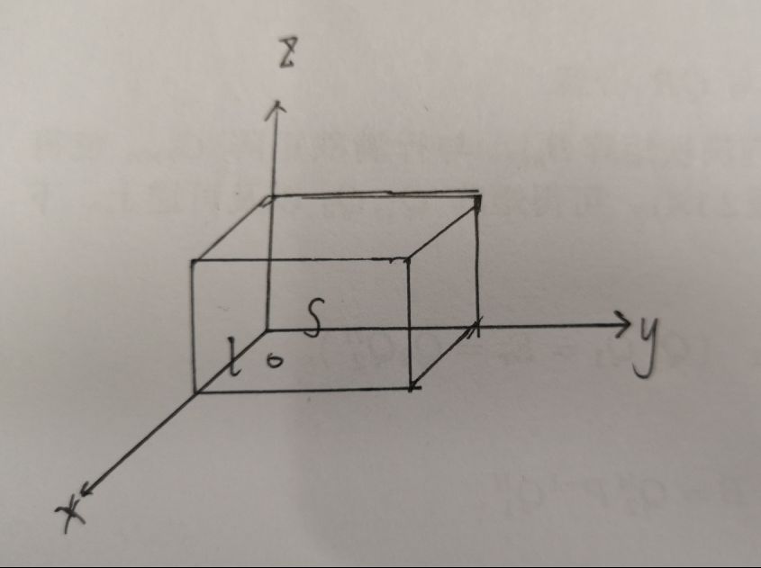

# 关于气体分子与容器壁相互作用的探究

## by 刘成锴 518030910425

## 动机

我们在推导理想气体压强公式时，是从微观上研究的。从微观上看，气体对容器壁的压力，是大量气体分子对其碰撞的集体效果。由此推导出理想气体作用于容器壁的压强公式
$$
p = nm\bar{v_x^2} = \frac{1}{3}nm\bar{v^2}
$$

我们在这个推导过程中并没有利用到麦克斯韦速率和速度分布，只利用到了$\bar{v_x^2} = \bar{v_y^2} = \bar{v_z^2}$。因此，我想要利用麦克斯韦速率和速度分布，对气体分子与容器壁的相互作用进行进一步的探究。

中学的时候，我们接触过“光压”问题，“光压”有一个应用就是让太阳光推动飞行器（因为光子是有动量的），使飞行器动量增加。于是，我就想到了一种可能存在的让气体分子推动容器运动的模型，即“气压”问题，结合麦克斯韦速率和速度分布在理想情况下进行定量计算。

## 问题

### 麦克斯韦速率和速度分布

在温度为T的平衡态上，一个粒子速度位于
$$
v_{x} \sim v_{x}+d v_{x}, \quad v_{y} \sim v_{y}+d v_{y}, \quad v_{z} \sim v_{z}+d v_{z}
$$
范围内的概率为
$$
d p=f(\vec{v}) d v_{x} d v_{y} d v_{z}=\left(\frac{m}{2 \pi k T}\right)^{3 / 2} e^{-\frac{m v^{2}}{2 k T}} d v_{x} d v_{y} d v_{z}
$$
即
$$
d p=F(v_x, v_y, v_z) d v_{x} d v_{y} d v_{z}=\left(\frac{m}{2 \pi k T}\right)^{3 / 2} e^{-\frac{m (v_x^2 + v_y^2 + v_z^2)}{2 k T}} d v_{x} d v_{y} d v_{z}
$$

为了进一步研究气体分子与容器壁的相互作用，我们假设：

在一个长$l$，横截面积为$S$的密闭的长方体容器中，有每个分子质量为$m$，温度为$T$，压强为$p_0$的理想气体。如图所示，$xy$平面为水平方向。

容器水平放置，假设某一时刻，突然去掉容器的后壁（ 后壁所在平面方程为$x = 0$ ），保留容器的前壁（ 前壁所在平面方程为$x = l$ ）。这样的话，分子就不会在前后壁之间来回碰撞了。

然后，我们来讨论以下问题。

（1）假设用外力固定容器，求$t$时刻，累计已与容器前壁碰撞的分子个数。

（2）假设用外力固定容器，这些分子与容器完全弹性碰撞，$t$时刻前一共能交换多少动量?

（3）假设容器是自由的，且容器质量为$M$，分子与容器完全弹性碰撞，求容器最后的速度。（为了方便计算，我假设容器很重，所以碰撞之后容器的速度很小，气体分子与容器的相对速度大小可以近似认为等于气体分子的速度大小）

## 探究过程
### （1）
我先将容器中的气体中的分子分为两类。

第一类：沿$x$正方向的速度大于等于$\frac{l}{t}$的，这些分子将全部撞到壁上，气体分子数密度$n_0$，有$p_0 = n_0kT$。

再利用麦克斯韦速率和速度分布，得到第一类分子数目$N_1$
$$
N_{1}=\int_{\frac{l}{t}}^{\infty} n_{0} S l \sqrt{\frac{m}{2 \pi k T}} e^{-\frac{m v_{x}^{2}}{2 k T}} d v_{x}=n_{0} S l\left[\frac{1}{2}-\frac{1}{\sqrt{\pi}} f\left(\frac{l}{t} \sqrt{\frac{m}{2 k T}}\right)\right] 
$$

第二类：沿$x$正方向的速度小于$\frac{l}{t}$的，这些分子只有$Svt$部分的体积能够撞到壁上，得到第二类分子中能够撞到壁上的分子数目$N_2$:
$$
N_{2}=\int_{0}^{\frac{l}{t}} n_{0} S v t \sqrt{\frac{m}{2 \pi k T}} e^{-\frac{m v_{x}^{2}}{2 k T}} d v_{x}=n_{0} t S \sqrt{\frac{k T}{2 \pi m}}\left[1-e^{-\frac{m l^{2}}{2 k T t^{2}}}\right]
$$

$t$时刻，累计已与容器右壁碰撞的分子个数$N$:
$$
N=N_{1}+N_{2}=\frac{p_{0}}{k T} t S \sqrt{\frac{k T}{2 \pi m}}\left[1-e^{-\frac{m l^{2}}{2 k T t^{2}}}\right]+\frac{p_{0}}{k T} S l\left[\frac{1}{2}-\frac{1}{\sqrt{\pi}} f\left(\frac{l}{t} \sqrt{\frac{m}{2 k T}}\right)\right]
$$

### (2)
同样的，我们将气体分子分为两类。

第一类：沿$x$正方向的速度大于等于$\frac{l}{t}$的分子

$$
P_{1}=\int_{\frac{l}{t}}^{\infty} 2 n_{0} S l v_{x} \sqrt{\frac{m}{2 \pi k T}} e^{-\frac{m v_{x}^{2}}{2 k T}} d v_{x}=n_{0} m l S \sqrt{\frac{2 k T}{\pi m}} e^{-\frac{m l^{2}}{2 k T t^{2}}}
$$

第二类：沿$x$正方向的速度小于$\frac{l}{t}$的并且可以撞到容器壁的分子

$$
P_{2}=\int_{0}^{\frac{l}{t}} 2 m v_{x} n_{0} S v t \sqrt{\frac{m}{2 \pi k T}} e^{-\frac{m v_{x}^{2}}{2 k T}} d v_{x}=2 n_{0} t S \frac{k T}{\sqrt{\pi}} f\left(\frac{l}{t} \sqrt{\frac{m}{2 k T}}\right)-n_{0} m l S \sqrt{\frac{2 k T}{\pi m}} e^{-\frac{m l^{2}}{2 k T t^{2}}}
$$

以上具体积分过程利用了分部积分法，即：

$$
\int_{0}^{x} u^{2} e^{-u^{2}} d u=\frac{1}{2} \int_{0}^{x} u e^{-u^{2}} d u^{2}=\frac{1}{2} \int_{0}^{x} u d e^{-u^{2}}=\frac{1}{2}\left[f(x)-x e^{-x^{2}}\right]
$$

最终得到，一共能交换多少动量$P$：
$$
P=P_{1}+P_{2}=2 n_{0} t S \frac{k T}{\sqrt{\pi}} f\left(\frac{l}{t} \sqrt{\frac{m}{2 k T}}\right)=2 t S \frac{p_{0}}{\sqrt{\pi}} f\left(\frac{l}{t} \sqrt{\frac{m}{2 k T}}\right)
$$

### （3）

经历充分久的时间后，即 $t \rightarrow+\infty$，我们得到了容器最终的动量大小

令$t \rightarrow+\infty$，有：
$$
P=P_{1}+P_{2}=2 t S \frac{p_{0}}{\sqrt{\pi}} \cdot \frac{l}{t} \sqrt{\frac{m}{2 k T}}=\frac{2 S p_{0}}{\sqrt{\pi}} l \sqrt{\frac{m}{2 k T}}
$$

容器的速度$V$：
$$
V=\frac{P}{M}=\frac{2 S p_{0}}{M} l \sqrt{\frac{m}{2 \pi k T}}
$$
其方向沿$x$轴的正方向。

即在气体分子的作用下，容器最终沿$x$轴正方向以大小为$V$的速度运动。

我认为这可以看做是在气压的作用下，容易动量增加，开始运动。

## 问题总结和思考

以上问题中，我通过麦克斯韦速率和速度分布的结论进行的定量计算。尽管计算量很大，但是结果并不难理解。希望这个问题能够抛砖引玉。

此外，在课本上“8-8 量子统计分布简介”这一节提及了一类适用于微观粒子体系平衡态的统计分布函数——玻色-爱因斯坦分布函数

$$
f_{BE}(E) = \frac{1}{e ^ {(E - E_0) / kT} - 1}
$$

它适用于具有整数自旋的微观粒子，由此这类微观粒子也称玻色子（boson），如光子，H，He等。

又有之前518021910701同学在讨论区提出了对“光子气”的探究。经过我的查阅，得知「空腔内的热辐射可以当做光子气来处理 」这一说法。也就是假设容器中的气体分子替换成了光子。于是我便有了**新的问题**：

> 在我之前问题中的那个模型中，容器内如果不是气体分子而是一团光子，我想最后容器同样可以获得一定的速度（与“光压”现象原理不同），与容器中是气体分子的情况类似。
> 
> 若要计算，我想可以利用到玻色-爱因斯坦分布函数，因为光子属于玻色子。但是由于本人水平有限，无法对其进行定性探究。

希望同学们能对我的问题中的疏漏进行批评指正。
希望有兴趣的同学们能够思考一下我最终提出的新的问题，或是提出更多有意思的问题供我们进行探究。